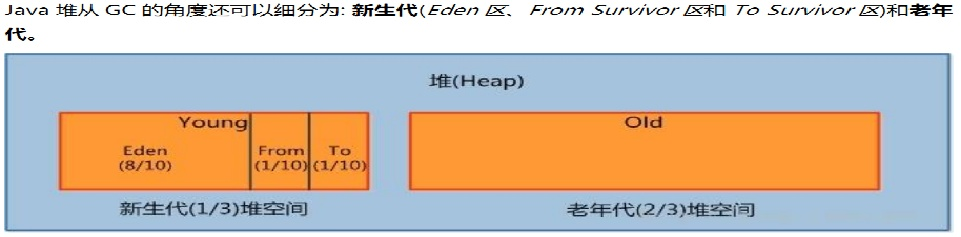
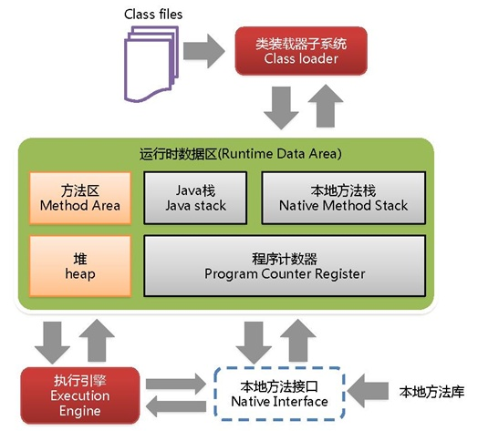

# [mysql 使用 innodb 引擎，请简述 mysql 索引的最左前缀，如何优化 order by 语句。](https://www.bilibili.com/video/BV1Bb411d7SL/?p=2)

## 最左前缀法则示例
假设 `index(a,b,c)`
| Where语句                                                 | 索引是否被使用                                                                           |
| --------------------------------------------------------- | ---------------------------------------------------------------------------------------- |
| `where a = 3`                                             | Y,使用到a                                                                                |
| `where a = 3 and b = 5`                                   | Y,使用到ab                                                                               |
| `where a = 3 and b = 5 and c = 4`                         | Y,使用到abc                                                                              |
| `where b = 3` 或 `where b = 3 and c = 4` 或 `where c = 4` | N                                                                                        |
| `where a = 3 and c = 5`                                   | 使用到a,但是c不可以,b中间断了                                                            |
| `where a = 3 and b > 4 and c = 5`                         | 使用到ab,c不能用在范围之后,b断了                                                         |
| `where a is null and b is not null`                       | `is null`支持索引 但是`is not null`不支持,所以a可以使用索引,但是b不一定能用上索引（8.0） |
| `where a <> 3`                                            | 不能使用索引                                                                             |
| `where abs(a) = 3`                                        | 查询语句包含函数不能使用索引                                                             |
| `where a = 3 and b like 'kk%' and c = 4`                  | Y,使用到abc                                                                              |
| `where a = 3 and b like '%kk' and c = 4`                  | Y,只用到a                                                                                |
| `where a = 3 and b like '%kk%' and c = 4`                 | Y,只用到a                                                                                |
| `where a = 3 and b like 'k%kk%' and c = 4`                | Y,使用到abc                                                                              |

> 启示：我们在创建索引的时候的顺序和我们在使用索引时候的顺序要保持一致，这样才能匹配上。  
> 为什么叫最左前缀？因为他是从最左边开始匹配的。  


## 关键点：
1. 如果排序字段不在索引列上， filesort 有两种算法： mysql 就要启动双路排序和单路排序
2. **无过滤不索引**：如果没有过滤条件的话就用不到索引。
3. order by 非最左 filesort
4. 顺序错 filesort
5. 方向反 filesort
6. 记不住多动手做实验，熟练使用 explain ，必要时使用 optimizer_trace
7. 更多参考尚硅谷 mysql 课程

[实验](最左前缀/实验.md)


## 答案：
1. 首先要对 sql 进行分析检查必要的查询字段，过滤字段，排序字段是否按顺序创建好了索引
2. 如果查询字段不再索引中可能会产生回表操作会导致 filesort ，降低性能
3. 一定要有过滤字段不然不能使用索引
4. 排序字段和索引顺序不一致会导致 filesort ，降低性能
5. 多个字段排序时如果方向不一致也会导致 filesort ，降低性能
6. 使用 explain 观察查询类型和索引利用情况
7. 尽可能减少不必要的 filesort


## 一般性建议
- 对于单键索引，尽量选择过滤性更好的索引（例如：手机号，邮件，身份证）
- 在选择组合索引的时候，过滤性最好的字段在索引字段顺序中，位置越靠前越好。
- 选择组合索引时，尽量包含 where 中更多字段的索引
- 组合索引出现范围查询时，尽量把这个字段放在索引次序的最后面
- 尽量避免造成索引失效的情况


# [JVM 内存模型中，为什么要区分新生代和年老代，对于新生代，为什么又要区分 eden 区 survial 区？](https://www.bilibili.com/video/BV1Bb411d7SL/?p=3)


## 关键点：
1. 分清 jvm 标准与实现
2. **分代收集算法** 在 g1 上是逻辑上的划分之前的垃圾回收器可以理解是物理上的
3. 标记算法
4. 清除算法
5. **内存连续空间**
6. 记不住联想一下下片儿
7. 更多参考尚硅谷 jvm 课程


## 答案：
1. 主流垃圾回收器 cms g1 都使用了分代收集算法
2. 正常系统运行时会有 **海量** **临时对象** 产生，这些对象短期内大部分就会失效，对于这些对象我们把他们临时放到新生代
3. 新生代满了之后需要清理垃圾对象，我们会把有效对象复制到老年代，以便后续继续使用
4. 为了更有效的区分哪些对象应该被复制到老年代，所以在新生代划分出了eden 去和 s0, s1 区域
5. 细化后的新生代内部被再次划分以便保证高速读写同时内存连续，
   1. 新对象会被保存到 eden 区（开始是空的所以内存连续）， eden 区满了会把有效对象复制到 s0（s0也是空的所以也是连续空间）
   2. 清空 eden 区（再次写入时又是连续空间）
   3. s0 和 s1 在命名上互换 原来的 s1 等待写入（空的）
   4. eden 区再次满了，重复上面步骤
6. eden 区通过复制/清除算法保证了读写连续性（因为新生代的对象产生和销毁非常频繁，所以才采用了清空的方式）


# [典型的JDBC程序按（）顺序编写](https://www.bilibili.com/video/BV1Bb411d7SL/?p=4)
> Java 程序经编译后会产生 byte code

1. 注册JDBC Driver
2. 获得与数据库的物理连接
3. 创建不同类型的Statement
4. 执行SQL语句
5. 如果是查询语句，处理结果集
6. 释放资源


# [请编写一个Java类Test.java，求出100以内既能被 2 除又能被 3 除的数，并输出到控制台上。](https://www.bilibili.com/video/BV1Bb411d7SL/?p=5)
[Test01.java](./Test01.java)


# [A 系统远程调用 B 系统的接口，A 系统在完成调用之后，需要更新 A 系统本地表](https://www.bilibili.com/video/BV1Bb411d7SL/?p=6)

## 问题1：常见的远程调用有几种？

### 关键点：
1. 网络协议与封装，所有的网络请求都是基于TCP或UDP协议的
2. 常用框架
3. 长短连接（复用）

### 答案：
1. 自定义协议实现 C/S RPC 调用（实现复杂，需解决的问题多）
2. UDP 广播类型（常见用于即时通讯类，速度快，但需要二次确认）
3. 目前主流的基于 http 协议调用（Restful 风格的api ， springcloud 微服务调用使用的就是http）
4. dubbo 协议（阿里出品，长连接，二进制封装数据，性能较高）
5. soap 协议（古老的 webservice 系列框架，基于 xml 实现数据封装， http 协议传输）
6. 异步响应式（WebFlux + Spring Data Reactive）
7. 服务器推（不主动调用，常见系统通知类）


## [问题2: 对于有这些外部衔接的方法需要注意哪些问题？请写出注意问题及伪代码](https://www.bilibili.com/video/BV1Bb411d7SL/?p=7)
1. 写好接口文档，方便后续维护和团队协作
2. 统一化的报文结构
3. 标准化的服务状态码
   ```java
   status_code 200; //请求成功
   ```
4. 统一化请求日志记录，及异常记录
   ```java
   logger.error("服务异常", exception);
   GlobalExceptionHandler...
   ```
5. 当请求延迟过高，可以快速失败
6. 重试机制
7. ```java
   // 服务列表
   serverList = {ser1, ser2, ser3};
   retrycount = 0;
   retrymax = 10;
   maxrequesttime = 200; //ms
   getxxoo() {
       try { // 尝试请求数据
           calldata(serverList)
       }catch (请求失败 500类异常 || 请求超时 calldata的网络请求方法中) {
           serverList.remove(刚才请求的服务器) // 拦截器记录日志
       if (retrycount == retrymax) // 重试次数过多
           return "当前访问不可用稍后再试";
       retrycount++;
       // 递归调用本方法
       }
   }
   ```
8. 事务问题，可回滚
   ```java
   getData() { // 分布式事务开启
       get1(); get2(); get3();
       // 事务结束
       // 要么全成功 要么全失败
       // 修改数据时使用 tryModify() 临时保存数据或通过Seata类似的框架实现
   }
   ```
9. 数据一致性问题
   ```java
   // 有并发修改数据时，如果需要保证一致性，需要使用分布式锁
   modifyxx() { // 修改方法
       // 尝试加锁
       boolean haslock = tryLock(id);
       if(haslock) {
           httppost(url, data);
           releaseLock(id);
       } else {
           // 提示用户一会再试试
           // 尝试再次获取锁
       }
   }
   ```


# [在如下代码中，当调用 insertA 方法的时候，是否能做当 insertA 到当调用 insertB 的时候，如果 insertB 插入 b 表的时候有异常，能否保证 insertA 中的 a 表插入成功，如果不能，应该如何修改。](https://www.bilibili.com/video/BV1Bb411d7SL/?p=8)
[TestService.java](./TestService.java)

## 关键点：
1. 数据库事务
2. 编程式事务 beginTransaction、commit、rollback
3. 声明式事务 @Transactional


## 答案：
1. 不能，在类上使用了 `@Transactional` 注解，默认开启了全局读写事务
2. 可以细粒度在方法上加注解


# [springboot 是如何管理版本依赖的？什么是自动配置、起步依赖？](https://www.bilibili.com/video/BV1Bb411d7SL/?p=9)

## springboot是如何管理版本依赖的？

### 关键点：
1. maven
2. springboot pom.xml 父子关系
3. spring-boot-starter

### 答案：
1. springboot 底层使用 maven 管理依赖，通过控制 pom.xml 父子关系来完成细节配置，在父 pom 中定义具体框架和版本号以及额外的信息。
2. 提供了很多场景的 spring-boot-starter 的 pom.xml 文件，来标准化的引入依赖避免冲突。


## [什么是自动配置？](https://www.bilibili.com/video/BV1Bb411d7SL/?p=10)

### 关键点：
1. 看springboot的源码
2. @SpringBootApplication 中包含的 @EnableAutoConfiguration ， @SpringBootConfiguration ， @ComponentScan 注解
3. @EnableAutoConfiguration 开启自动配置功能 内部还包含 @AutoConfigurationPackage 、 @Import
   1. @AutoConfigurationPackage 中 @Import(AutoConfigurationPackages.Registrar.class) 引入了 Registrar.class 完成批量注册，默认扫描主启动类的包 @Bean 或者 @Compont 等注解
   2. @Import(AutoConfigurationImportSelector.class)
4. @ComponentScan 扫描被 @Compent(@Service@Controller) 注解的 bean 加载到容器中
5. @SpringBootConfiguration 表示这是一个 SpringBoot 的配置类

### 答案：
1. **所加载使用的jar包 如果是比较常见的，spring 都提供了默认配置，也就是不像以前一样需要把框架的每一个属性都要配置一遍，主要目的是简化开发**
2. springboot 通过在启动类上添加注解 @SpringBootApplication 完成自动配置
3. 内部完成了读取每个jar包下的 `META-INF/spring.factories` 和spring-boot-autoconfigure-x.x.x.jar 中的默认配置


## 起步依赖？

### 答案：
指的是各种 starter 重点是 pom.xml ，其中包含了框架所需要的其他依赖以及默认配置文件，不需要我们手动配置了。


# [数据库索引的原理？创建索引的缺点是什么，什么情况索引失效？优化数据库的方法有哪些？](https://www.bilibili.com/video/BV1Bb411d7SL/?p=11)

## 关键点：
1. 哪种数据库（其实关系型的都差不多）
2. 以 mysql 为例 b+ 树
3. 索引的好处和代价
4. 索引失效的情况
5. 优化：
   1. 硬件层面（运维
   2. 软件层面（调优


## 数据库索引的原理？
1. 以 mysql 为例，默认引擎 InnoDB 使用了 b+ 树实现索引，在索引查找时 实现了 log(n) 的时间复杂度
2. 聚簇索引记录了主键 id（完整数据），非聚簇索引的索引树中记录数据（索引字段+主键）
3. 在聚簇索引的叶子节点中记录了完整的值，非聚簇索引的叶子节点记录的是主键以及索引字段，如果需要完整值的话需要回表操作，即使用主键去聚簇索引中再次查找完整数据
4. 索引的叶子节点以链表的形式存储，方便顺序查找和排序


## [创建索引的缺点（代价）是什么？](https://www.bilibili.com/video/BV1Bb411d7SL/?p=12)
1. 会占用空间
2. 更新时会级联更新索引
3. 高并发写影响性能


## [什么情况索引失效？](https://www.bilibili.com/video/BV1Bb411d7SL/?p=13)
1. 计算、函数导致索引失效
2. LIKE 以 % 开头索引失效
3. 不等于( `!=` 或者 `<>` )索引失效
4. IS NOT NULL 可能失效（不同版本和数据决定） IS NULL 有效
5. 类型转换导致索引失效
6. 数据库优化器觉得不用索引更快的时候失效


## [优化数据库的方法有哪些？](https://www.bilibili.com/video/BV1Bb411d7SL/?p=14)
1. 硬件（主要在存储层优化）CPU、内存、网卡、硬盘（企业级SSD）。最好使用独立的硬盘挂在数据。
2. 网络：优化网卡，增加更大的带宽提升网络吞吐量。
3. 操作系统调优：TCP/IP协议的。
4. 表结构设计优化：减少跨表查询，增加冗余字段。合理的字段长度。特别长的字符串最好使用 blob 或者 text 类型，如果是固定长度的字符串最好使用 char 类型。时间类型使用 timestamp 而不是 datetime。
5. sql 优化：where等值匹配在范围匹配前，按照 order by 建立好索引。
6. 减少函数使用
7. 索引优化
8. 大字段及全文检索优化：优化业务逻辑，能不用大字段就不用大字段。全文检索使用 es 等。
9. 连接池优化
10. 事务优化：锁的优化，减少锁的粒度，减少锁的时间。减少事务的使用，使用更低的隔离级别。
11. 数据库集群化：读写分离，主从复制，分库分表，分区。
12. 加入缓存
13. 冷热存储
14. 分库分表


# [Integer和 int 的区别](https://www.bilibili.com/video/BV1Bb411d7SL/?p=15)

## 关键点：
1. 堆栈存储基础数据类型与对象
2. 值比对的时候注意 java 的自动拆箱
3. Integer 值大小在 -128 到 127 之内 使用 IntegerCache


## 答案：
1. Integer 是 int 的包装类，int 则是 java 的一种基本的数据类型；
2. Integer 实际是对象的引用，当 new 一个 Integer 时，实际上生成一个指针指向对象，而 int 则直接存储数值
3. Integer 的默认值是 null，而 int 的默认值是 0。


# [jsp 的八个隐含对象有哪些](https://www.bilibili.com/video/BV1Bb411d7SL/?p=16)

## 关键点：
1. jsp 本质上就是 Servlet
2. 答不上来关系也不大


## 答案：

### 1 pageContext
- 类型：PageContext
- 代表：当前页面的上下文
- 作用：可以获取到页面中的其他隐含对象，同时它还是一个域对象。

### 2 request
- 类型：HttpServletRequest
- 代表：请求
- 作用：可以获取用户发送的请求信息，它也是一个域对象。

### 3 session
- 类型：HttpSession
- 代表：当前会话
- 作用：可以作为域对象，用来共享数据。

### 4 application
- 类型：ServletContext
- 代表：代表整个WEB应用
- 作用：是JavaWeb中最大的域对象。

### 5 response
- 类型：HttpServletResponse
- 代表：响应
- 作用：向浏览器发送响应信息

### 6 out
- 类型：JspWriter
- 代表：输出流
- 作用：可以向页面输出内容

### 7 config
- 类型：ServletConfig
- 代表：当前JSP的配置信息
- 作用：可以获取到 Servlet 标签中初始化参数

### 8 page
- 类型：Object 在 service 方法中有如下代码 `Object page = this;`
- 代表：代表当前JSP的对象

### 9 exception
- 类型：Throwable
- 代表：异常信息
- 作用：获取页面中的异常


# [数据库三范式是什么](https://www.bilibili.com/video/BV1Bb411d7SL/?p=17)

## 第一范式
- 单表（字段）拆分到不可拆分为止
  - 张三，街道地址方便分组 联系方式（手机号，email）
  - 有主键，具有原子性，字段不可分割

| id  | 姓名 | 性别 | 地址                             | 公司     | 职位       |
| --- | ---- | ---- | -------------------------------- | -------- | ---------- |
| 1   | 123  | 男   | 五环外北京市昌平区回龙观xxoo小区 | 阿里巴巴 | java架构师 |
| 1   | 123  | 男   | 五环外北京市昌平区回龙观xxoo小区 | 阿里巴巴 | java架构师 |
| 1   | 123  | 男   | 五环外北京市昌平区回龙观xxoo小区 | 阿里巴巴 | java架构师 |

改动后
| id  | 姓名 | 性别 | 城市         | 区     | 具体           | 公司     | 职位       |
| --- | ---- | ---- | ------------ | ------ | -------------- | -------- | ---------- |
| 1   | 123  | 男   | 五环外北京市 | 昌平区 | 回龙观xxoo小区 | 阿里巴巴 | java架构师 |
| 1   | 123  | 男   | 五环外北京市 | 昌平区 | 回龙观xxoo小区 | 阿里巴巴 | java架构师 |
| 1   | 123  | 男   | 五环外北京市 | 昌平区 | 回龙观xxoo小区 | 阿里巴巴 | java架构师 |


## 第二范式
- 每一行数据唯一性
  - 订单地址重复，引用其他表
  - 多表关联

| id  | 姓名 | 性别 | 地址id | 地址分类 | 公司     | 职位       |
| --- | ---- | ---- | ------ | -------- | -------- | ---------- |
| 1   | 123  | 男   | 1      | 家       | 阿里巴巴 | java架构师 |
| 1   | 123  | 男   | 2      | 公司     | 阿里巴巴 | java架构师 |
| 1   | 123  | 男   | 3      | 女友家   | 阿里巴巴 | java架构师 |

| id  | 城市         | 区     | 具体           |
| --- | ------------ | ------ | -------------- |
| 1   | 五环外北京市 | 昌平区 | 回龙观xxoo小区 |
| 2   | 五环外北京市 | 昌平区 | 回龙观xxoo小区 |
| 3   | 五环外北京市 | 昌平区 | 回龙观xxoo小区 |


## 第三范式
表之间关联主键依赖
- 单行数据中保留唯一主键，建立外键关联表

| id  | 姓名 | 性别 | 地址id | 公司     | 职位       |
| --- | ---- | ---- | ------ | -------- | ---------- |
| 1   | 123  | 男   | 1      | 阿里巴巴 | java架构师 |
| 1   | 123  | 男   | 2      | 阿里巴巴 | java架构师 |
| 1   | 123  | 男   | 3      | 阿里巴巴 | java架构师 |

| id  | 城市         | 区     | 具体           | 地址分类 |
| --- | ------------ | ------ | -------------- | -------- |
| 1   | 五环外北京市 | 昌平区 | 回龙观xxoo小区 | 家       |
| 2   | 五环外北京市 | 昌平区 | 回龙观xxoo小区 | 公司     |
| 3   | 五环外北京市 | 昌平区 | 回龙观xxoo小区 | 女友家   |


## 答案：
1. 数据库三范式是设计数据库表的方法论，能够充分的利用关系型数据库把实体有机的关联起来
2. 降低耦合度节省存储空间


# [什么是 Spring 的依赖注入？有哪些方法进行依赖注入](https://www.bilibili.com/video/BV1Bb411d7SL/?p=18)

## 关键点：
1. IOC （Inversion of Control 控制翻转 ）
2. DI （Dependency Injection 依赖注入）


## 答案：
依赖注入是指将依赖的对象实例交给 spring 帮我们注入管理，从而释放对对象的管理权，比如可以统一替换接口的实现，更高效的开发程序
1. set方法注入
2. 构造方法注入
3. @Autowire 自动注入


# [说一下你理解的 JVM 原理](https://www.bilibili.com/video/BV1Bb411d7SL/?p=19)


## 关键点：
1. jvm 标准与实现
2. 解决了跨平台问题
3. JMM 内存管理
4. JVM 模型
5. 不同的垃圾回收器


## 答案：
jvm 是 java 虚拟机，我们的 class 文件运行在虚拟机上，通过虚拟机解决了跨平台的问题， jvm 中有 jmm 来管理 java 内存访问的方式，不同的 jvm 实现性能关注有差异，现在主流的实现是 Hotspot ，垃圾回收器是 G1 ， jvm 运行时内存中分为方法区，堆，栈，本地方法栈，执行代码时需要执行引擎。


