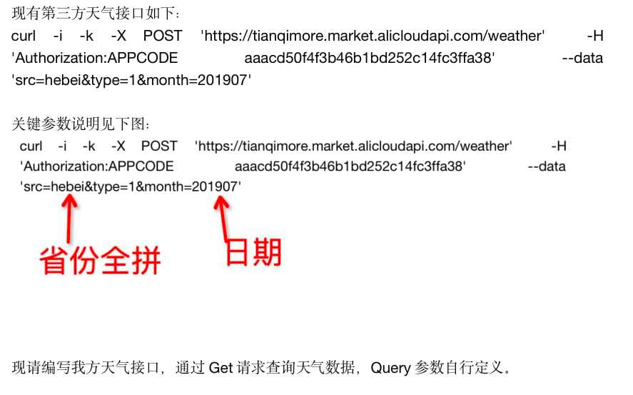
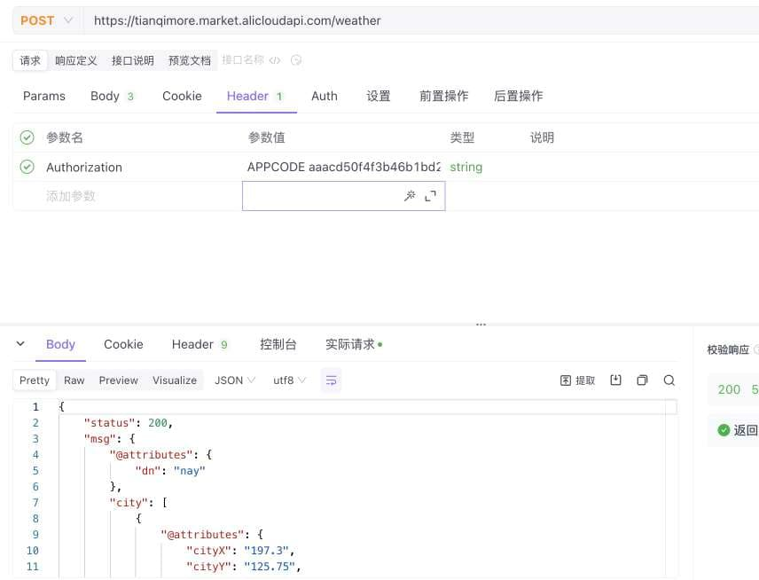
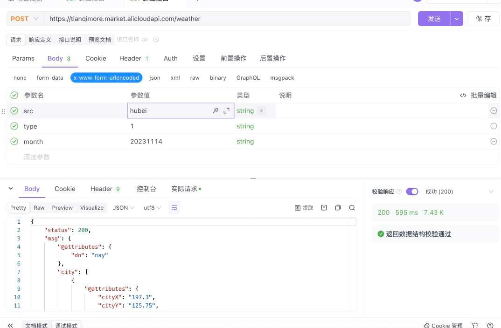

```bash
curl -i -k -X POST 'https://tianqimore.market.alicloudapi.com/weather' -H 'Authorization:APPCODE aaacd50f4f3b46b1bd252c14fc3ffa38' --data 'src=hebei&type=1&month=201907'
```





---
遇到的问题与解决

### 1 参数传递与接收
```java
@RequestParam("src") String src, @RequestParam("month") String month
```
@RequestParam接收 `curl -i -k -X POST 'http://localhost:8080/weather' --data 'src=shanxi&month=201907'` 传递的参数


```java
@RequestBody WeatherReqBody weatherReqBody
```
@RequestBody接收 `curl -i -k -X POST 'http://localhost:8080/weather' -H 'Content-Type:application/json' --data '{"src":"shanxi","month":"201907"}'` 传递的参数


### 2 构造请求头
```java
headers.add("'Authorization:APPCODE", "aaacd50f4f3b46b1bd252c14fc3ffa38");
```
Authorization前多加了一个单引号，导致请求头错误，返回403


### 3 请求参数
```java
Map<String, String> paraameterMap = new HashMap<>(); //!
paraameterMap.put("src", src);
paraameterMap.put("type", "1");
paraameterMap.put("month", month);
```

应该使用 `MultiValueMap` 传递参数
```java
MultiValueMap<String, String> paraameterMap = new LinkedMultiValueMap<>();
paraameterMap.add("src", src);
paraameterMap.add("type", "1");
paraameterMap.add("month", month);
```


### 4 函数调用参数顺序
```java
new HttpEntity<>(headers, paraameterMap);
```

应该是
```java
new HttpEntity<>(paraameterMap, headers);
```


